# 🚛 Autonomous Fleet Intelligence Engine

**A WhatsApp-first AI system that handles truck/bus breakdowns for a logistics company — end to end, without anyone needing to install an app.**

🔗 **Live App:** [fleet-swarm-project.vercel.app](https://fleet-swarm-project.vercel.app/)

> Think of it as an AI operations manager that never sleeps: the moment a truck breaks down, it diagnoses the problem, finds the nearest repair shop, gets spare-part prices from vendors, negotiates the best deal, and keeps the driver, the fleet manager, and the vendor all talking to each other — over plain WhatsApp.

---

## 📖 What problem does this solve?

If you run a fleet of trucks or buses (this project is built around a real logistics company, **Beekay Infra & Logistics**, operating in Bihar, India), a breakdown on the highway today usually looks like this:

- Driver calls the manager → manager is busy or driving → call goes unanswered
- Manager has no idea what's actually wrong with the vehicle
- Someone has to manually search for a nearby mechanic/workshop
- Someone has to call 2-3 spare-part vendors, ask prices, and negotiate
- Nobody tracks whether the truck ever actually got fixed
- If the same truck breaks down for the same reason every month, nobody notices the pattern

This project replaces that entire chaotic phone-call process with **one WhatsApp conversation per person** — the driver chats with the bot, the manager chats with the bot, and the vendor chats with the bot. The AI in the middle does the diagnosis, the routing, the price comparison, and the follow-up.

**No app to install. No training needed. If someone can use WhatsApp, they can use this system.**

---

## 🎯 Real, practical use cases

1. **A driver's truck breaks down on a highway at 2 AM.** He opens WhatsApp and either types the problem, sends a **voice note** in Hindi/Hinglish, or just **sends a photo** of the damaged part. The AI understands it, figures out the likely fault, and finds the nearest authorized service center automatically (using live Google Maps data).
2. **The fleet manager gets an instant WhatsApp alert** with the vehicle, issue, nearest workshop, and AI-suggested spare part — with **Approve ✅ / Reject ❌** buttons. No app, no dashboard login needed, no typing.
3. **The manager rejects a workshop** (too far / bad reviews) → the system **automatically reroutes to the next nearest one** and re-asks for approval — instead of the manager having to search again.
4. **Before any part is bought, 2–3 nearby vendors are contacted automatically** on WhatsApp, asked for price & availability, and the AI even **negotiates one round** if a vendor's price is higher than a competitor's (without ever leaking the competitor's exact price). The manager just picks the best price with one tap.
5. **The driver sends a photo of a damaged part any time during the repair.** If it's something small and safe (a loose wire, low coolant, a blown fuse), the AI gives the driver **step-by-step DIY instructions** right there in the chat — saving a mechanic visit entirely. If it's serious, it escalates to the manager immediately, flagged by severity (LOW/MODERATE/HIGH/CRITICAL).
6. **If a driver says "accident" or "aag lag gayi" (fire) or similar,** the AI detects the emergency instantly and fires a separate 🆘 CRITICAL alert to the manager — it doesn't wait in the normal message queue.
7. **If a driver goes quiet after a repair is dispatched,** the AI proactively checks in on its own ("kaisi chal rahi hai repair?") instead of the manager having to remember to follow up.
8. **If the same vehicle keeps breaking down with a similar issue** (e.g. radiator problems 3 times in 90 days), the manager sees a 🔁 **Predictive Maintenance Alert** right on the very first approval message — before approving yet another one-off repair, they're nudged to book a full inspection instead.
9. Every diagnosis the AI makes and a human later verifies is **permanently learned** — so the next time a similar issue comes up, the system answers with confidence from its own growing knowledge base instead of guessing again.

---

## 🧠 How it works (the actual flow)

```
   DRIVER                    AI ENGINE (this project)                 MANAGER              VENDOR
     │                                │                                  │                    │
     │──(text / voice / photo)───────▶│                                  │                    │
     │                                │  1. Understands the problem       │                    │
     │                                │     (Gemini + Hybrid RAG search   │                    │
     │                                │      over real repair manuals)    │                    │
     │                                │  2. Finds nearest workshop        │                    │
     │                                │     (Google Maps + Places)        │                    │
     │                                │  3. Sends Approve/Reject alert ──▶│                    │
     │                                │                                  │──Reject──▶ auto-reroute to next hub
     │                                │                                  │──Approve──┐          │
     │                                │  4. Asks 2-3 vendors for price ─────────────┼─────────▶│
     │                                │                                  │          │◀─price────│
     │                                │  5. Negotiates if needed ───────────────────┼─────────▶│
     │                                │  6. Shows manager best price ◀──────────────┘          │
     │                                │                                  │──picks vendor──▶     │
     │◀──"Accept Repair" button───────│                                  │                    │
     │──taps Accept──────────────────▶│  Chat is now LIVE with AI agent  │                    │
     │──(sends photo mid-repair)─────▶│  7. Vision AI diagnoses photo    │                    │
     │◀──DIY steps OR "help coming"───│     (self-fix if safe, escalate  │                    │
     │                                │      to manager if serious) ────▶│                    │
     │                                │  8. If driver goes silent,       │                    │
     │◀──proactive check-in───────────│     follows up automatically     │                    │
```

Everything above happens through **one Meta WhatsApp Business number** — the "AI Engine" box is a FastAPI backend that receives every WhatsApp message as a webhook, decides who sent it (driver / manager / vendor) and what they mean, and replies instantly.

---

## ✨ Full feature list

### Core AI / Agentic pipeline
- **Multi-Agent Swarm architecture** — Triage & Vision Agent → Hybrid RAG Diagnostics Agent → Routing & Logistics Agent → Manager-Approval/ERP Agent, each one logged and traced independently.
- **Hybrid Search RAG** — combines BM25 keyword search with vector similarity + cross-encoder reranking over a real, expandable knowledge base of vehicle repair manuals (drop in more `.json` manual files any time, no code change needed).
- **Corrective RAG (CRAG) with a hallucination grader** — before recommending a spare part, the system checks that the part is actually grounded in the retrieved manual text. If it isn't confident, it falls back to a live Gemini AI diagnosis, clearly labeled "AI-generated, verify before dispatch" — never presented with false certainty.
- **Self-Improving Knowledge Base** — once a manager approves an AI-generated diagnosis, it's permanently saved, so the identical issue next time gets an instant, high-confidence, manual-grounded answer.
- **Multi-Modal Vision** — real Gemini Vision analysis of photos (both at the initial report stage and any time later in the chat).

### WhatsApp-native experience (for drivers, managers, and vendors — zero app installs)
- **Text, voice note, and photo support** — a driver can type, speak (Hindi/Hinglish/regional), or just send a picture.
- **Interactive buttons** for every decision point — Approve/Reject, Accept Repair, Vendor Yes/No, Pick Vendor — nobody has to type free text for the important steps.
- **Automatic hub re-routing** — a manager's "Reject" instantly triggers the next-nearest workshop's approval card.
- **Spare-Part Price Comparison & Negotiation** — multiple vendors are contacted in parallel, prices are compared automatically, and the AI runs one negotiation round with a higher-priced vendor without revealing competitors' numbers.
- **In-chat Photo Diagnosis + Self-Service Repair Guidance** — minor issues get DIY fix instructions instead of an automatic mechanic dispatch, saving time and cost.
- **Language auto-matching** — the AI always replies in the same script/language the sender used (Hindi, Hinglish, or English).
- **Urgency detection** — every message is silently scored NORMAL / URGENT / CRITICAL, with life-threatening situations (accident, fire, injury) triggering an instant standalone alert to the manager.
- **Proactive follow-up** — if a driver goes silent after a repair is dispatched, the AI checks in on its own rather than waiting to be asked.
- **Per-vehicle predictive maintenance** — repeating issues on the same vehicle are automatically flagged to the manager before they approve yet another quick fix.
- **Live location sharing** — a driver's shared WhatsApp location is instantly forwarded to the manager with a clickable map link.

### Reliability & engineering
- **SQLite-backed persistent state** — every incident, approval, and quote survives a server restart/redeploy (not just kept in memory).
- **Rate limiting & API-key protection** on the endpoints the frontend calls, so the paid Gemini/Maps/WhatsApp APIs behind them can't be abused.
- **Full observability tracing** — every agent step is logged with a trace ID, latency, and payload, in a LangSmith/Arize-style format.

---

## 📸 See it in action

### 1. The Manager's Dashboard (web app)
This is where an incident is first reported/injected into the system — either by an admin, or automatically when a driver reports a breakdown by voice note. It runs the full Agentic RAG pipeline and shows the diagnosis live.

| Reporting a breakdown & getting a manual-grounded diagnosis | A trickier issue falling back to live AI diagnosis |
|---|---|
| 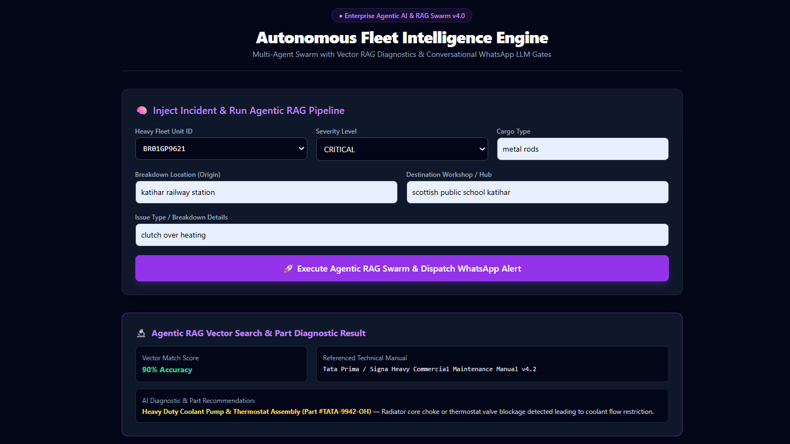 | 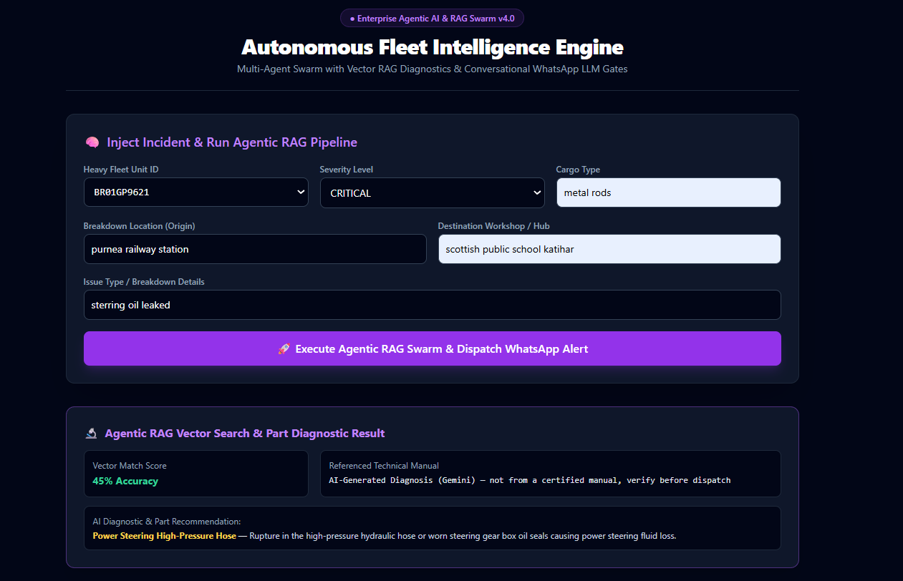 |
| Clutch overheating → matched instantly to the Tata Prima manual at 90% confidence, with the exact spare part. | Steering oil leak → no manual matched confidently, so Gemini generates a real diagnosis on the spot, honestly labeled "AI-Generated" instead of faking manual-level certainty. |

### 2. The Driver's WhatsApp
The driver never sees a dashboard — everything happens in one chat thread with the fleet's WhatsApp number.

| Repair & parts confirmed | Tapping "Accept Repair" activates the AI agent |
|---|---|
| 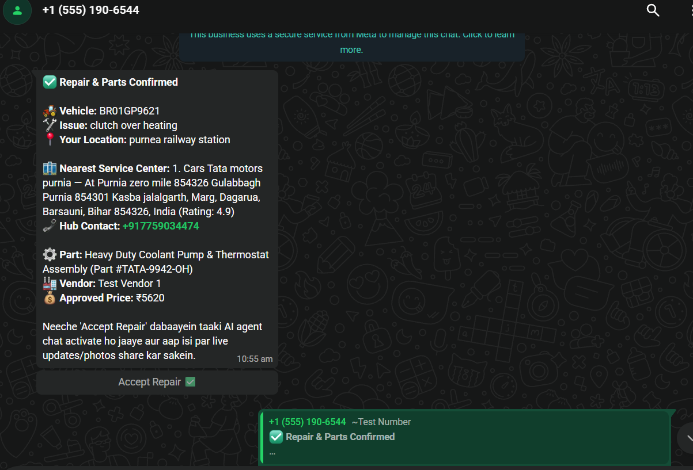 |  |

| Driver sends a photo mid-repair — AI diagnoses it instantly | Full AI diagnosis + natural back-and-forth chat |
|---|---|
| 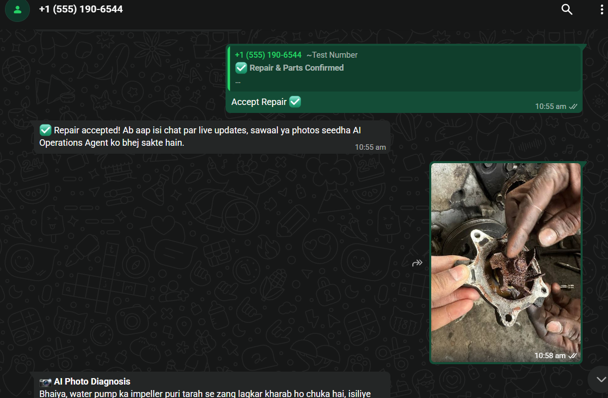 |  |

| Driver asks the AI to escalate to the manager | AI keeps the driver updated on dispatch status |
|---|---|
|  | 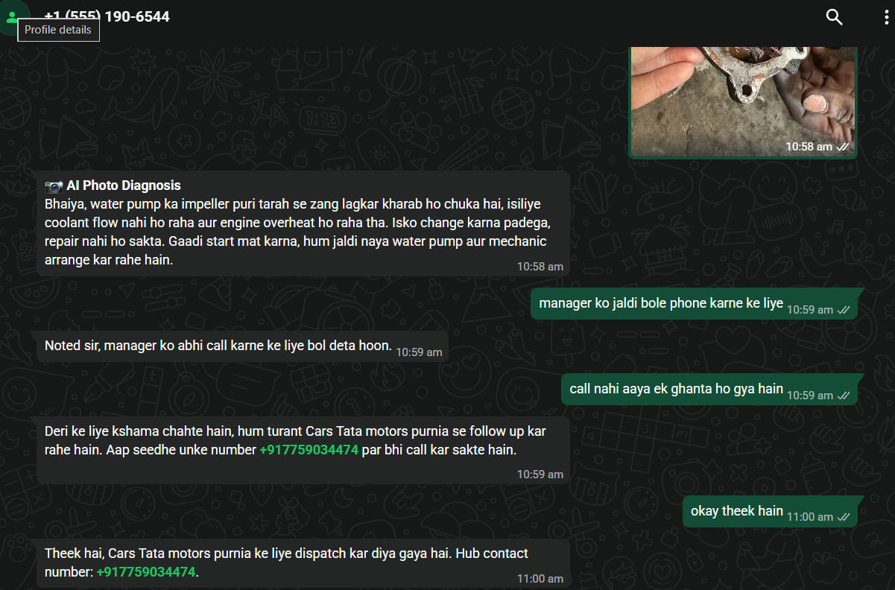 |

*(In this real conversation, the driver's water pump had failed completely — the AI correctly identified it as unrepairable, told the driver not to start the vehicle, and kept him informed while a replacement was arranged.)*

### 3. The Vendor's WhatsApp
Spare-part vendors near the breakdown location are contacted automatically — no manual phone calls by the manager.

| Vendor gets an availability enquiry with Yes/No buttons | AI negotiates the price down in real time |
|---|---|
| 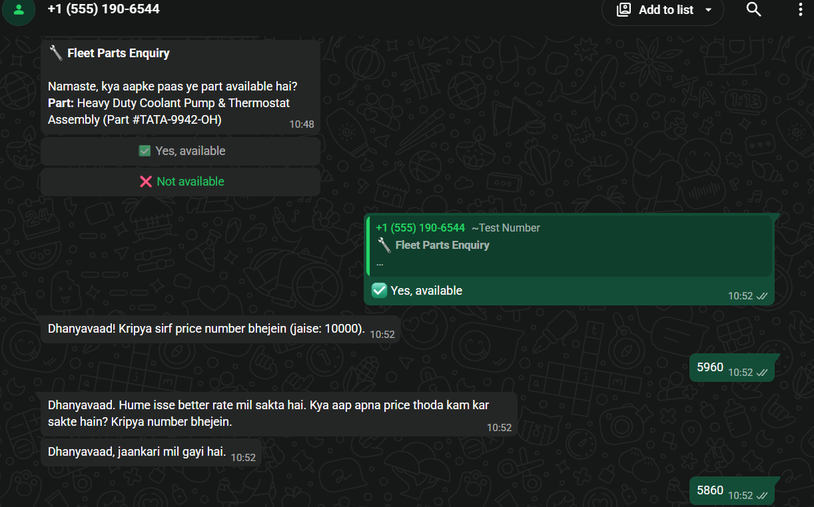 | 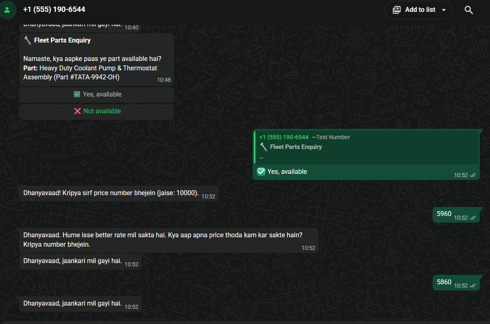 |

| A second vendor is contacted the same way, in parallel |
|---|
| 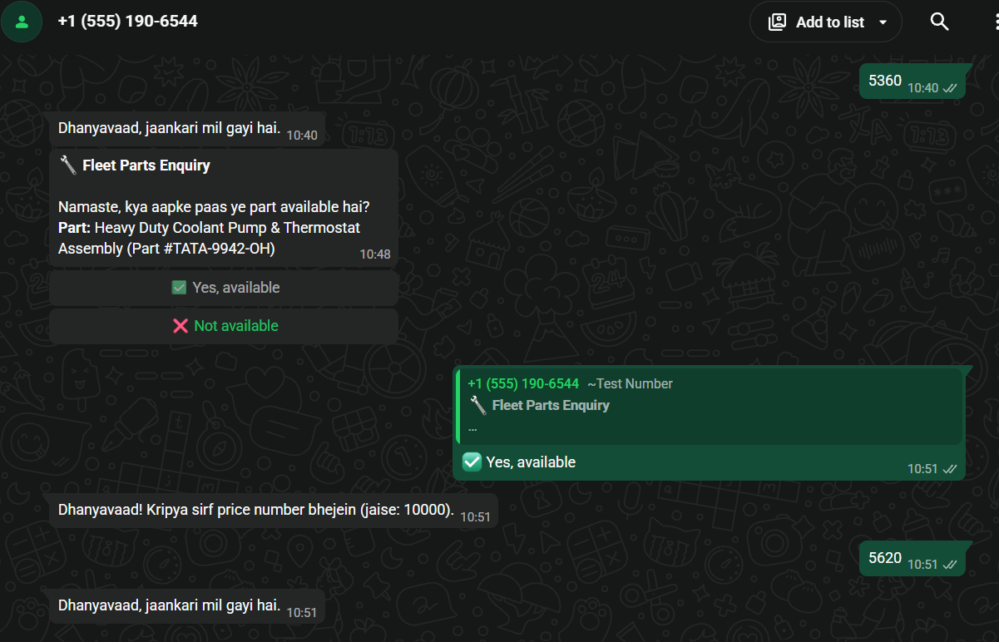 |

### 4. The Manager's WhatsApp
The manager makes every real decision with a single tap — no typing, no app.

| AI shows a side-by-side price comparison; manager picks the best one | Driver's mid-repair photo is escalated with a CRITICAL severity flag |
|---|---|
| 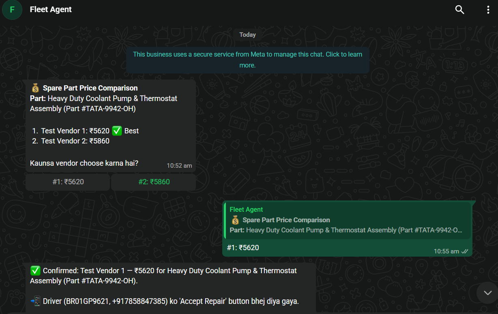 | 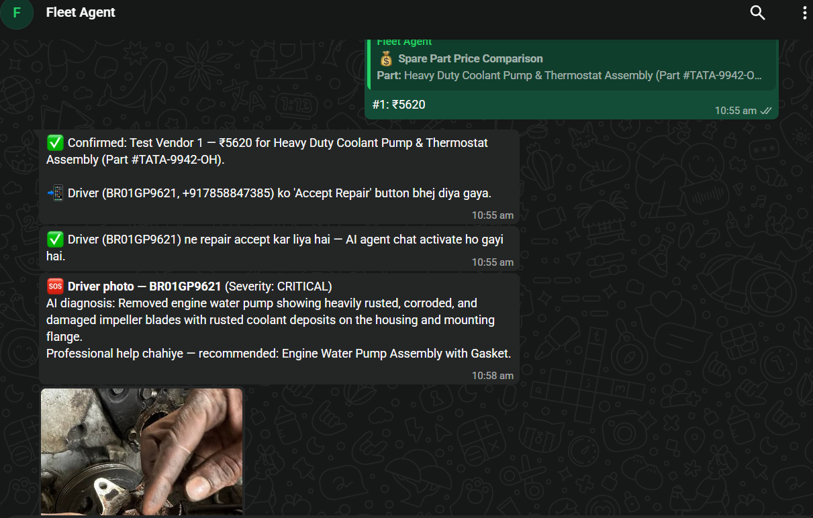 |

| The exact photo and AI diagnosis, with an emergency-level alert |
|---|
| 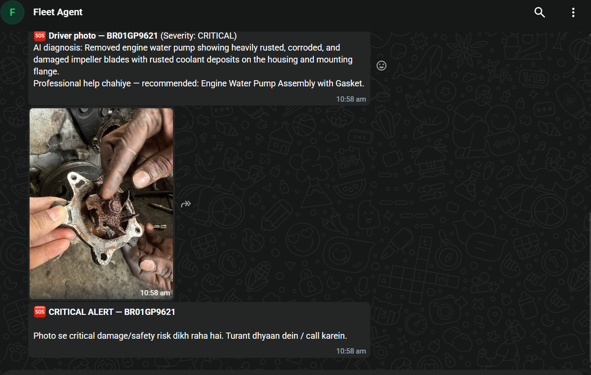 |

---

## 🏗️ Tech stack

| Layer | Technology |
|---|---|
| Backend API | Python, FastAPI |
| Frontend dashboard | React + Tailwind CSS (deployed on Vercel) |
| AI / LLM | Google Gemini (text + vision) |
| Search / RAG | BM25 + vector hybrid search, cross-encoder reranking |
| Maps & routing | Google Maps Places, Geocoding & Directions APIs |
| Messaging | WhatsApp Business Cloud API (Meta) |
| Persistence | SQLite (survives restarts/redeploys) |
| Hosting | Backend on Render, Frontend on Vercel |

---

## 📁 Project structure

```
fleet-swarm-project/
├── backend/
│   ├── main.py                  # FastAPI app — all endpoints, WhatsApp webhook, agent orchestration
│   ├── advanced/                 # Hybrid search, self-RAG, multi-agent graph, observability, vision
│   ├── knowledge_base/           # Repair-manual documents (JSON) the RAG engine searches — add more any time
│   ├── tests/                    # Backend test suite
│   └── requirements.txt
├── frontend/
│   ├── src/App.js                # The manager's web dashboard (incident injection + live status)
│   └── ...
├── docs/screenshots/              # Screenshots used in this README
└── workflows/ci.yml               # CI pipeline
```

---

## ⚙️ Running it yourself

### Backend

```bash
cd backend
pip install -r requirements.txt
uvicorn main:app --reload
```

Environment variables it reads (set these before running for real, otherwise the relevant feature simply falls back to a safe simulated/skipped mode instead of crashing):

| Variable | What it's for |
|---|---|
| `WHATSAPP_TOKEN` | Meta WhatsApp Business Cloud API access token |
| `PHONE_NUMBER_ID` | Your WhatsApp Business phone number ID |
| `GEMINI_API_KEY` | Powers all the AI understanding, diagnosis, vision, and language matching |
| `GOOGLE_MAPS_API_KEY` | Nearby workshop search, geocoding, and route calculation |
| `FLEET_API_KEY` | Protects `/api/triage` and `/api/send-whatsapp-interactive` from public abuse |
| `FOLLOWUP_CHECK_DELAY_SECONDS` | How long to wait before proactively checking in on a silent driver (default: 2 hours) |
| `PREDICTIVE_PATTERN_WINDOW_DAYS` | How far back to look for repeat issues on the same vehicle (default: 90 days) |
| `PREDICTIVE_PATTERN_MIN_REPEATS` | How many repeats before flagging a predictive-maintenance warning (default: 2) |

### Frontend

```bash
cd frontend
npm install
npm start
```

Set `REACT_APP_API_URL` to point at your backend if it's not running locally.

---

## 🔌 Key API endpoints

| Endpoint | Purpose |
|---|---|
| `POST /api/triage` | Runs the full Agentic RAG pipeline for a new incident |
| `POST /api/send-whatsapp-interactive` | Sends the Approve/Reject card to the manager on WhatsApp |
| `GET /api/approval-status/{incident_id}` | Lets the dashboard poll for the manager's decision |
| `POST /api/whatsapp-webhook` | Where every incoming WhatsApp message (from driver/manager/vendor) actually lands and gets handled |
| `GET /api/health` | Simple health check |

---

## 🚧 Good to know / current limitations

- The free hosting tier (Render) can "sleep" when idle — background timers (like the proactive follow-up) reset if the server restarts, though all incident data itself is safely persisted.
- Forwarding a driver's actual photo to the manager (not just the AI's text description of it) is best-effort and depends on your WhatsApp Business setup — the text diagnosis always goes through regardless.
- Vendor phone numbers are currently a small test list for demoing the price-comparison flow; swapping in real vendor numbers found via Google Places is a one-line config change (see the `TEST_VENDOR_NUMBERS` / `TEST_HUB_NUMBERS` notes in `backend/main.py`).

---

Built for **Beekay Infra & Logistics** as a real, working prototype of what an AI-run fleet operations desk can look like — one that talks to everyone on the road in the one app they already have open: WhatsApp.
